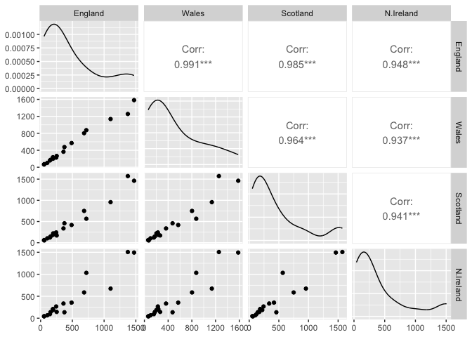

# Class 07: Machine Learning 1
Barry (PID: 911)

# Clustering

We will start today’s lab with clustering methods, in particular
so-called K-means. The main function for this in R is `kmeans()`.

Let’s try it on some made up data where we know what thwe answer should
be.

``` r
x <- rnorm(10000, mean=3)
hist(x)
```


60 points

``` r
tmp <- c(rnorm(30, mean=3), rnorm(30, -3) )
x <- cbind(x=tmp, y=rev(tmp))
head(x)
```

                x         y
    [1,] 2.658029 -3.492573
    [2,] 3.154163 -3.938171
    [3,] 2.241175 -1.494775
    [4,] 4.480206 -3.839694
    [5,] 2.499888 -2.440903
    [6,] 3.326269 -3.395899

We can pass this to the base R `plot()` function for a quick.

``` r
plot(x)
```


``` r
k <- kmeans(x, centers = 2, nstart=20)
k
```

    K-means clustering with 2 clusters of sizes 30, 30

    Cluster means:
              x         y
    1  3.009165 -3.027233
    2 -3.027233  3.009165

    Clustering vector:
     [1] 1 1 1 1 1 1 1 1 1 1 1 1 1 1 1 1 1 1 1 1 1 1 1 1 1 1 1 1 1 1 2 2 2 2 2 2 2 2
    [39] 2 2 2 2 2 2 2 2 2 2 2 2 2 2 2 2 2 2 2 2 2 2

    Within cluster sum of squares by cluster:
    [1] 40.86984 40.86984
     (between_SS / total_SS =  93.0 %)

    Available components:

    [1] "cluster"      "centers"      "totss"        "withinss"     "tot.withinss"
    [6] "betweenss"    "size"         "iter"         "ifault"      

> Q1. How many points are in each cluster?

``` r
k$size
```

    [1] 30 30

> Q2. Cluster membership?

``` r
k$cluster
```

     [1] 1 1 1 1 1 1 1 1 1 1 1 1 1 1 1 1 1 1 1 1 1 1 1 1 1 1 1 1 1 1 2 2 2 2 2 2 2 2
    [39] 2 2 2 2 2 2 2 2 2 2 2 2 2 2 2 2 2 2 2 2 2 2

> Q3. Cluster centers?

``` r
k$centers
```

              x         y
    1  3.009165 -3.027233
    2 -3.027233  3.009165

> Q4. Plot my clustering results

``` r
plot(x, col=k$cluster, pch=16 )
```


> Q5. Cluster the data again with kmeans() into 4 groups and plot the
> results.

``` r
k4 <- kmeans(x, centers = 4, nstart=20)
plot(x, col=k4$cluster, pch=16)
```


K-means is very popular mostly because it is fast and relatively
straightforward to run and understand. It has a big limitation in that
you need to tell it how many groups (k, or centers) you want.

# Hierarchical clustering

The main function in base R is called `hclust()`. You have to pass it in
a “distance matrix” not just your input data.

You can generate a distance matrix with the `dist()` function.

``` r
hc <- hclust( dist(x) )
hc
```


    Call:
    hclust(d = dist(x))

    Cluster method   : complete 
    Distance         : euclidean 
    Number of objects: 60 

``` r
plot(hc)
```


To find the clusters (cluster membership vector) from a `hclust()`
result we can “cut” the tree at a certain height that we like. For this
we use the `cutree()` function.

``` r
plot(hc)
abline(h=8, col="red")
```


``` r
grps <- cutree(hc, h=8)
```

``` r
table(grps)
```

    grps
     1  2 
    30 30 

> Q6. Plot our hclust results.

``` r
plot(x, col=grps, pch=16)
```


# Principal Component Analysis

## PCA of UK food data

Read data showing the consumption in grams (per person, per week) of 17
different types of food-stuff measured and averaged in the four
countries of the United Kingdom.

Let’s see how PCA can help us but first we can try conventional
analysis.

``` r
url <- "https://tinyurl.com/UK-foods"
x <- read.csv(url)
x
```

                         X England Wales Scotland N.Ireland
    1               Cheese     105   103      103        66
    2        Carcass_meat      245   227      242       267
    3          Other_meat      685   803      750       586
    4                 Fish     147   160      122        93
    5       Fats_and_oils      193   235      184       209
    6               Sugars     156   175      147       139
    7      Fresh_potatoes      720   874      566      1033
    8           Fresh_Veg      253   265      171       143
    9           Other_Veg      488   570      418       355
    10 Processed_potatoes      198   203      220       187
    11      Processed_Veg      360   365      337       334
    12        Fresh_fruit     1102  1137      957       674
    13            Cereals     1472  1582     1462      1494
    14           Beverages      57    73       53        47
    15        Soft_drinks     1374  1256     1572      1506
    16   Alcoholic_drinks      375   475      458       135
    17      Confectionery       54    64       62        41

I need to fix that first column…

``` r
rownames(x) <- x[,1]
x <- x[,-1]
head(x)
```

                   England Wales Scotland N.Ireland
    Cheese             105   103      103        66
    Carcass_meat       245   227      242       267
    Other_meat         685   803      750       586
    Fish               147   160      122        93
    Fats_and_oils      193   235      184       209
    Sugars             156   175      147       139

``` r
url <- "https://tinyurl.com/UK-foods"
x <- read.csv(url, row.names=1)
```

A pairs plot can be useful if we don’t have too many dimensions…

``` r
pairs(x, col=rainbow(17), pch=16, cex=2)
```


## Principal Component Analysis (PCA)

PCA can help us make sense of these types of datasets. Let’s see how it
works.

The main function in “base” R is called `prcomp()`. In this case we want
to first take the transpose `t()` of our input `x` so the columns are
the food types and the countries are the rows.

``` r
head( t(x) )
```

              Cheese Carcass_meat  Other_meat  Fish Fats_and_oils  Sugars
    England      105           245         685  147            193    156
    Wales        103           227         803  160            235    175
    Scotland     103           242         750  122            184    147
    N.Ireland     66           267         586   93            209    139
              Fresh_potatoes  Fresh_Veg  Other_Veg  Processed_potatoes 
    England               720        253        488                 198
    Wales                 874        265        570                 203
    Scotland              566        171        418                 220
    N.Ireland            1033        143        355                 187
              Processed_Veg  Fresh_fruit  Cereals  Beverages Soft_drinks 
    England              360         1102     1472        57         1374
    Wales                365         1137     1582        73         1256
    Scotland             337          957     1462        53         1572
    N.Ireland            334          674     1494        47         1506
              Alcoholic_drinks  Confectionery 
    England                 375             54
    Wales                   475             64
    Scotland                458             62
    N.Ireland               135             41

``` r
pca <- prcomp( t(x) )
summary(pca)
```

    Importance of components:
                                PC1      PC2      PC3       PC4
    Standard deviation     324.1502 212.7478 73.87622 4.189e-14
    Proportion of Variance   0.6744   0.2905  0.03503 0.000e+00
    Cumulative Proportion    0.6744   0.9650  1.00000 1.000e+00

``` r
pca$x
```

                     PC1         PC2         PC3           PC4
    England   -144.99315    2.532999 -105.768945  2.842865e-14
    Wales     -240.52915  224.646925   56.475555  7.804382e-13
    Scotland   -91.86934 -286.081786   44.415495 -9.614462e-13
    N.Ireland  477.39164   58.901862    4.877895  1.448078e-13

``` r
plot( pca$x[,1], pca$x[,2], 
      col=c("orange", "red", "blue", "darkgreen"), 
      pch=16 )
```


The “loadings” tell us how much the origional variables (in our case the
foods) contribute to the new variables i.e. the PCs

``` r
head(pca$rotation)
```

                            PC1         PC2         PC3         PC4
    Cheese         -0.056955380 -0.01601285 -0.02394295 -0.69171804
    Carcass_meat    0.047927628 -0.01391582 -0.06367111  0.63538491
    Other_meat     -0.258916658  0.01533114  0.55384854  0.19817592
    Fish           -0.084414983  0.05075495 -0.03906481 -0.01582463
    Fats_and_oils  -0.005193623  0.09538866  0.12522257  0.05234744
    Sugars         -0.037620983  0.04302170  0.03605745  0.01448135

``` r
## Lets focus on PC1 as it accounts for > 90% of variance 
par(mar=c(10, 3, 0.35, 0))
barplot( pca$rotation[,1], las=2 )
```


Stop at Q9

## ggplot

``` r
library(tidyr)

# Add the rownames back as a column
y <- cbind(food=rownames(x),x)
rownames(y) <- NULL
head(y)
```

                food England Wales Scotland N.Ireland
    1         Cheese     105   103      103        66
    2  Carcass_meat      245   227      242       267
    3    Other_meat      685   803      750       586
    4           Fish     147   160      122        93
    5 Fats_and_oils      193   235      184       209
    6         Sugars     156   175      147       139

``` r
z <- pivot_longer(y, 
                  cols = !food, 
                  names_to = "country", 
                  values_to = "count")
```

The first argument is the dataset to reshape, `y`

`cols` describes which columns need to be reshaped. In this case, it’s
every column apart from `food`

`names_to` gives the name of the variable that will be created from the
data stored in the column names, i.e. `country`.

values_to gives the name of the variable that will be created from the
data stored in the cell value, i.e. count.

``` r
library(ggplot2)

ggplot(z) +
  aes(food, count, col=country) +
  geom_point() +
  theme(axis.text.x = element_text(angle = 90, 
                                   vjust = 0.5, 
                                   hjust = 1))
```


``` r
ggplot(z) +
  aes(food, count) +
  geom_boxplot() +
  theme(axis.text.x = element_text(angle = 90, 
                                   vjust = 0.5, 
                                   hjust = 1))
```


``` r
ggplot(z) +
  aes(food, count, fill=country) +
  geom_col() +
  theme(axis.text.x = element_text(angle = 90, 
                                   vjust = 0.5, 
                                   hjust = 1))
```


``` r
ggplot(z) +
  aes(food, count, fill=country) +
  geom_col(position='dodge') +
  theme(axis.text.x = element_text(angle = 90, 
                                   vjust = 0.5, 
                                   hjust = 1))
```


``` r
ggplot(z) +
  aes(country, count, fill=food) +
  geom_col() +
  theme(axis.text.x = element_text(angle = 90, 
                                   vjust = 0.5, 
                                   hjust = 1))
```


``` r
ggplot(z) +
  aes(food, count, fill=country) +
  geom_col() +
  theme(axis.text.x = element_text(angle = 90, 
                                   vjust = 0.5, 
                                   hjust = 1)) +
  facet_wrap(vars(country), ncol=1)
```


## Using ggplot for these figures

We could use **ggplot** to make somewhat better figures than all of the
above “base” R `plots()` and `barplots()`. Even though they may look
better they won’t really help us understand major trends to any better
degree (we will do that with PCA in the next section).

``` r
library(tidyr)
library(ggplot2)


# try with row.names
#m <- read.csv(url, row.names = 1)

q <- tibble::rownames_to_column(x, "Food")

# Put in longer format
foods <- pivot_longer(q, 
                  cols = !Food, 
                  names_to = "Country", 
                  values_to = "Count")

head(foods)
```

    # A tibble: 6 × 3
      Food            Country   Count
      <chr>           <chr>     <int>
    1 "Cheese"        England     105
    2 "Cheese"        Wales       103
    3 "Cheese"        Scotland    103
    4 "Cheese"        N.Ireland    66
    5 "Carcass_meat " England     245
    6 "Carcass_meat " Wales       227

Now we can do some plotting

``` r
ggplot(foods) +
  aes(Count, Food, col=Country) +
  geom_point()
```


``` r
ggplot(foods) +
  aes(Count, Food, fill=Country) +
  geom_col()
```


``` r
ggplot(foods) +
  aes(Count, Food, fill=Country) +
  geom_col(position='dodge') +
  theme_bw() +
  scale_x_continuous(expand=c(0,0))
```


``` r
ggplot(foods) +
  aes(Count, Food, col=Country) +
  geom_point() +
  geom_segment(aes(x=0,
                   xend=Count,
                   y=Food, 
                   yend=Food), color="gray") +
  geom_point()
```


``` r
ggplot(foods) +
  aes(Count, Food) +
  geom_boxplot() +
  geom_point(aes(col=Country))
```


``` r
pairs(x, col=rainbow(17), pch=16)
```


``` r
library(GGally)
```

    Registered S3 method overwritten by 'GGally':
      method from   
      +.gg   ggplot2

``` r
ggpairs(x) 
```



## Optional: Using ggplot for these figures

We could use the **ggplot2** package to make somewhat better figures
than all of the above “base” R `plots()` and `barplots()`. Recall that
ggplot works with data.frames and unfortunately most of the output of
these older base R functions like `prcomp()` are lists of vectors and
matrices.

So first we will need to take whatever it is we want to plot and convert
it to a data.frame with the `as.data.frame()` function. Then to make our
plotting life easier we will also add the food labels as a column
(called “Food”) to this data frame with the `rownames_to_column()`
function from the **tibble** package (you might need to install this):

``` r
df <- as.data.frame(pca$x)
df_lab <- tibble::rownames_to_column(df, "Country")

# Our first basic plot
ggplot(df_lab) + 
  aes(PC1, PC2, col=Country) + 
  geom_point()
```


And then we can get carried away and make this look much nicer:

``` r
ggplot(df_lab) + 
  aes(PC1, PC2, col=Country, label=Country) + 
  geom_hline(yintercept = 0, col="gray") +
  geom_vline(xintercept = 0, col="gray") +
  geom_point(show.legend = FALSE) +
  geom_label(hjust=1, nudge_x = -10, show.legend = FALSE) +
  expand_limits(x = c(-300,500)) +
  xlab("PC1 (67.4%)") +
  ylab("PC2 (28%)") +
  theme_bw()
```


Let’s do the same for our loadings/PC contributions figures. This data
is stored in the `pca$rotation` object that we convert to a data frame,
add the useful row names as a new column and then plot and customize
with additional ggplot layers. Which do you prefer, base graphics or
ggplot?

``` r
ld <- as.data.frame(pca$rotation)
ld_lab <- tibble::rownames_to_column(ld, "Food")

ggplot(ld_lab) +
  aes(PC1, Food) +
  geom_col() 
```


We can now add some additional features to the plot, such as reordering
the y axis by the PC1 loadings and selecting a rather ugly color scale
(to match our country colors) and our prefered theme layer.

``` r
ggplot(ld_lab) +
  aes(PC1, reorder(Food, PC1), bg=PC1) +
  geom_col() + 
  xlab("PC1 Loadings/Contributions") +
  ylab("Food Group") +
  scale_fill_gradient2(low="purple", mid="gray", high="darkgreen", guide=NULL) +
  theme_bw()
```


